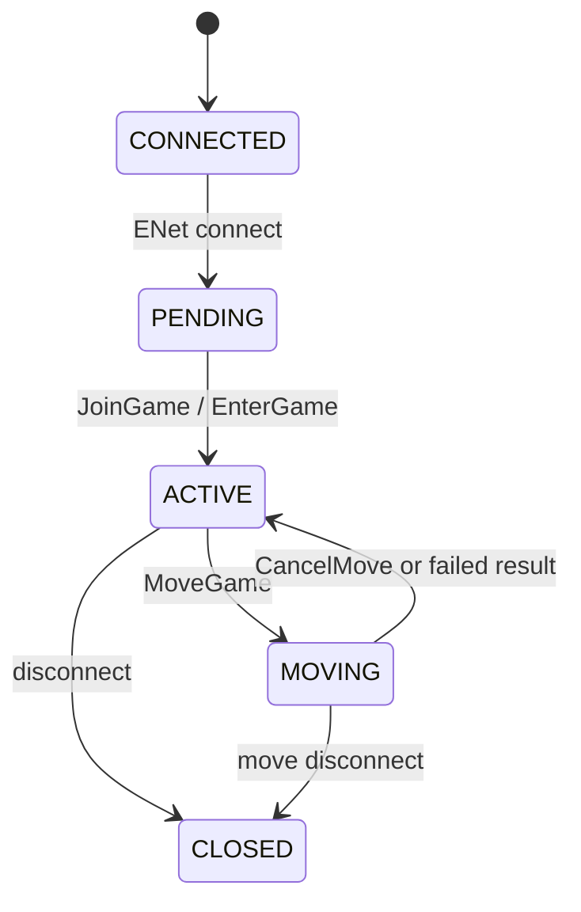

# XYSKY UDP

English | [中文](README_zh.md)

**XYSKY UDP** is a multiplayer room server implementing the network protocol used by
*Sky: Children of the Light* (client 0.34.5). It is written in Node.js, uses
[ENet](https://www.npmjs.com/package/sky-enet) for reliable UDP game traffic, and exposes
read-only HTTP status endpoints plus Prometheus metrics.

One process hosts **one room** with up to **8 joined players**. It can run completely
standalone, or register itself with a **QWD** room manager so that many nodes form a
dynamically allocated, auto-balancing fleet.

> This is an independent community research / server implementation project. It is not
> affiliated with or endorsed by thatgamecompany. You are responsible for ensuring your use
> of client assets, network services, and deployment complies with applicable terms and law.

## Deployment Modes

XYSKY UDP supports two modes, selected purely by whether `qwd.url` is set in `config.yml`.

### Standalone (default)

`qwd.url` is empty. The node does **not** connect to or register with any manager and simply
serves a single 8-player room at its public UDP address.

```text
XYSky (HTTP/WS backend)  ──direct UDP──▶  XYSKY UDP Node  ──▶  up to 8 players
```

In XYSky's own config, point `udp.uri` straight at this node's public UDP `IP:Port`.

### QWD-managed

`qwd.url` points at a QWD (Room Authority / Room Manager) WebSocket endpoint. On startup the
node connects over WebSocket and registers its `public_uri`. QWD then allocates rooms and
coordinates cross-room moves across all registered nodes.

```text
XYSky ──HTTP(S) /allocate──▶ QWD ──WebSocket──▶ XYSKY UDP Node ──public_uri──▶ Sky client
```

In this mode XYSky's `udp.uri` is the QWD **HTTP(S) `/allocate`** address, while the node's
`qwd.url` is the QWD **WebSocket** address — two different endpoints. See the companion
manager project under `qwd/` ([README](https://github.com/that-sky-project/that-sky-xysky-udp-room-authority/blob/main/README.md)).

## Requirements

- Node.js 20 or newer
- npm
- A C/C++ build toolchain for the native `sky-enet` module (on Windows: Visual Studio Build
  Tools / Desktop C++ workload; on Linux: `build-essential` + Python 3)
- An available UDP port reachable by clients

## Install And Run

```bash
npm install
npm start
```

With the default `config.yml` the node listens on:

```text
ENet UDP: 0.0.0.0:19133
HTTP TCP: 0.0.0.0:19133
```

TCP and UDP may share the same port number. Development mode with auto-reload: `npm run dev`.

## Configuration

All configuration lives in **`config.yml`** (loaded from the working directory). The server
reads **no environment variables** — `config.yml` is the single source of configuration.

```yaml
env: development          # development | test | production
logging:
  level: info             # pino level; use "debug" for protocol diagnostics
  pretty: false           # human-readable logs (auto-enabled when env is development)

room:
  host: 0.0.0.0           # ENet UDP bind address
  port: 19133             # ENet UDP port
  public_uri: 192.168.11.4:19133  # PUBLIC UDP endpoint reported to QWD / clients
  max_peers: 64           # ENet connection slots (joined players still capped at 8)
  channels: 2             # ENet channels
  tick_rate: 10           # sync ticks per second
  max_packet_bytes: 16384 # max accepted client packet size
  bad_packet_limit: 8     # close a session after this many malformed packets
  move_timeout_ms: 20000  # revert a stuck MOVING session to ACTIVE after this (ms)
  move_targets: []        # optional static migration targets

http:
  host: 0.0.0.0           # HTTP status/metrics bind address
  port: 19133             # HTTP TCP port

qwd:
  url: ""                 # EMPTY => standalone. Set a wss:// address to use a QWD manager.
```

| Key | Default | Description |
| --- | --- | --- |
| `env` | `development` | Runtime environment |
| `logging.level` | `info` | Pino log level |
| `logging.pretty` | `false` | Pretty logs (forced on in `development`) |
| `room.host` | `0.0.0.0` | ENet UDP bind address |
| `room.port` | `19133` | ENet UDP port |
| `room.public_uri` | — | Public UDP `IP:Port` clients actually reach (see below) |
| `room.max_peers` | `64` | ENet connection slots; joined players capped at 8 |
| `room.channels` | `2` | ENet channel count |
| `room.tick_rate` | `10` | Synchronization ticks per second |
| `room.max_packet_bytes` | `16384` | Maximum client packet size |
| `room.bad_packet_limit` | `8` | Malformed-packet limit before the session is closed |
| `room.move_timeout_ms` | `20000` | Revert a session stuck in MOVING back to ACTIVE after this |
| `room.move_targets` | `[]` | Static migration targets (JSON/YAML array) |
| `http.host` | `0.0.0.0` | HTTP listen address |
| `http.port` | `19133` | HTTP TCP port |
| `qwd.url` | `""` | QWD WebSocket URL. **Empty = standalone, no manager connection.** |

### `room.public_uri`

This is the UDP address **clients must be able to reach**, which is often different from the
bind `host`. Behind NAT or on a cloud host, set it to your public `IP:Port` (for example
`123.123.123.123:19133`), not to `0.0.0.0`. It is the value reported to QWD and handed to
clients.

### Enabling / disabling QWD

- **Standalone:** leave `qwd.url: ""`. No manager connection or room registration occurs.
- **QWD-managed:** set `qwd.url: "wss://your-qwd-host"`. The node connects on startup, retries
  automatically on disconnect, and registers its `public_uri`.

## Connection State Machine



## HTTP Status & Metrics

The HTTP server is read-only and unauthenticated — keep it on a trusted network or behind a
proxy. Endpoints include `/health`, `/rooms`, `/players`, `/levels`, `/move/targets`,
`/move/pending`, and `/metrics` (Prometheus format).

## License

[GNU Affero General Public License v3.0](LICENSE).
