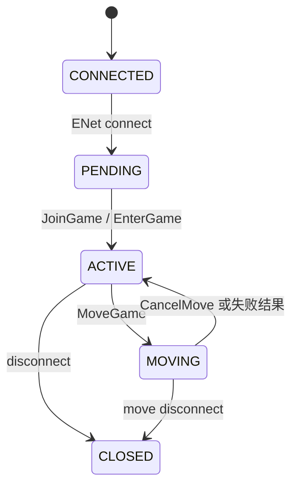

# XYSKY UDP

[English](README.md) | 中文

**XYSKY UDP** 是面向《Sky: Children of the Light》（客户端 0.34.5）网络协议的多人房间服务端。
使用 Node.js 开发，基于 [ENet](https://www.npmjs.com/package/sky-enet) 提供可靠 UDP 游戏通信，
并对外暴露只读的 HTTP 状态接口与 Prometheus 指标。

单个进程托管**一个房间**，最多 **8 名已加入玩家**。它既可以完全独立运行，也可以向 **QWD**
房间管理器注册，让多个节点组成一个动态分配、自动均衡的集群。

> 本项目为独立的社区技术研究 / 服务端实现项目，与 thatgamecompany 无隶属或官方合作关系。
> 使用者应自行确认对客户端资源、网络服务与部署行为的使用符合适用条款和当地法律。

## 部署模式

XYSKY UDP 支持两种模式，完全由 `config.yml` 中 `qwd.url` 是否填写来决定。

### 独立模式（默认）

`qwd.url` 为空。节点**不会**连接或注册到任何管理器，只在自己的公网 UDP 地址上提供一个 8 人房间。

```text
XYSky（HTTP/WS 后端）  ──直连 UDP──▶  XYSKY UDP Node  ──▶  最多 8 名玩家
```

此模式下，XYSky 的 `udp.uri` 直接填写本节点的公网 UDP `IP:端口`。

### QWD 托管模式

`qwd.url` 指向 QWD（房间权威 / 房间管理器）的 WebSocket 地址。节点启动时通过 WebSocket 连接并
注册自己的 `public_uri`。随后由 QWD 负责房间分配，并在所有已注册节点之间协调跨房间迁移。

```text
XYSky ──HTTP(S) /allocate──▶ QWD ──WebSocket──▶ XYSKY UDP Node ──public_uri──▶ Sky 客户端
```

此模式下，XYSky 的 `udp.uri` 是 QWD 的 **HTTP(S) `/allocate`** 地址，而节点的 `qwd.url` 是
QWD 的 **WebSocket** 地址——两者是不同的端点。配套的管理器项目见 `qwd/`（[README](https://github.com/that-sky-project/that-sky-xysky-udp-room-authority/blob/main/README_zh.md)）。

## 环境要求

- Node.js 20 或更高版本
- npm
- 用于编译原生 `sky-enet` 模块的 C/C++ 工具链（Windows：Visual Studio 生成工具 / 桌面 C++ 工作负载；
  Linux：`build-essential` + Python 3）
- 一个客户端可访问的 UDP 端口

## 安装与启动

```bash
npm install
npm start
```

使用默认 `config.yml` 时，节点监听：

```text
ENet UDP: 0.0.0.0:19133
HTTP TCP: 0.0.0.0:19133
```

TCP 与 UDP 可以使用相同端口号。开发模式（自动重载）：`npm run dev`。

## 配置说明

全部配置都在 **`config.yml`** 中（从工作目录加载）。服务端**不读取任何环境变量**，`config.yml`
是唯一的配置来源。

```yaml
env: development          # development | test | production
logging:
  level: info             # pino 日志级别；排查协议问题用 "debug"
  pretty: false           # 可读日志（env 为 development 时自动开启）

room:
  host: 0.0.0.0           # ENet UDP 绑定地址
  port: 19133             # ENet UDP 端口
  public_uri: 192.168.11.4:19133  # 上报给 QWD / 客户端的公网 UDP 地址
  max_peers: 64           # ENet 连接槽数量（已加入玩家仍限制为 8）
  channels: 2             # ENet channel 数量
  tick_rate: 10           # 每秒同步 tick 数
  max_packet_bytes: 16384 # 接受的最大客户端数据包字节数
  bad_packet_limit: 8     # 单连接坏包达到该次数后关闭会话
  move_timeout_ms: 20000  # 卡在 MOVING 的会话超过该时间后恢复为 ACTIVE（毫秒）
  move_targets: []        # 可选的静态迁移目标

http:
  host: 0.0.0.0           # HTTP 状态/指标绑定地址
  port: 19133             # HTTP TCP 端口

qwd:
  url: ""                 # 为空 => 独立运行。填写 wss:// 地址即可接入 QWD 管理器。
```

| 配置项 | 默认值 | 说明 |
| --- | --- | --- |
| `env` | `development` | 运行环境 |
| `logging.level` | `info` | Pino 日志级别 |
| `logging.pretty` | `false` | 可读日志（`development` 下强制开启） |
| `room.host` | `0.0.0.0` | ENet UDP 绑定地址 |
| `room.port` | `19133` | ENet UDP 端口 |
| `room.public_uri` | — | 客户端实际访问的公网 UDP `IP:端口`（见下） |
| `room.max_peers` | `64` | ENet 连接槽；已加入玩家仍限制为 8 |
| `room.channels` | `2` | ENet channel 数量 |
| `room.tick_rate` | `10` | 每秒同步 tick 数 |
| `room.max_packet_bytes` | `16384` | 最大客户端数据包字节数 |
| `room.bad_packet_limit` | `8` | 关闭会话前允许的坏包次数 |
| `room.move_timeout_ms` | `20000` | MOVING 卡住超过该时间后恢复为 ACTIVE |
| `room.move_targets` | `[]` | 静态迁移目标（数组） |
| `http.host` | `0.0.0.0` | HTTP 监听地址 |
| `http.port` | `19133` | HTTP TCP 端口 |
| `qwd.url` | `""` | QWD WebSocket 地址。**为空 = 独立运行，不连接管理器。** |

### `room.public_uri`

这是**客户端必须能访问到的** UDP 地址，通常与绑定用的 `host` 不同。在 NAT 之后或云主机上，应填写
你的公网 `IP:端口`（例如 `123.123.123.123:19133`），而不是 `0.0.0.0`。该值会上报给 QWD 并下发给客户端。

### 开启 / 关闭 QWD

- **独立运行：** 保持 `qwd.url: ""`，不会连接管理器，也不会注册房间。
- **QWD 托管：** 填写 `qwd.url: "wss://你的-qwd-地址"`。节点启动时连接，断线自动重连，并注册其 `public_uri`。

## 连接状态机



## HTTP 状态与指标

HTTP 服务是只读且无鉴权的——请放在可信网络内或反向代理之后。接口包括 `/health`、`/rooms`、
`/players`、`/levels`、`/move/targets`、`/move/pending`，以及 `/metrics`（Prometheus 格式）。

## 许可证

[GNU Affero General Public License v3.0](LICENSE)。
